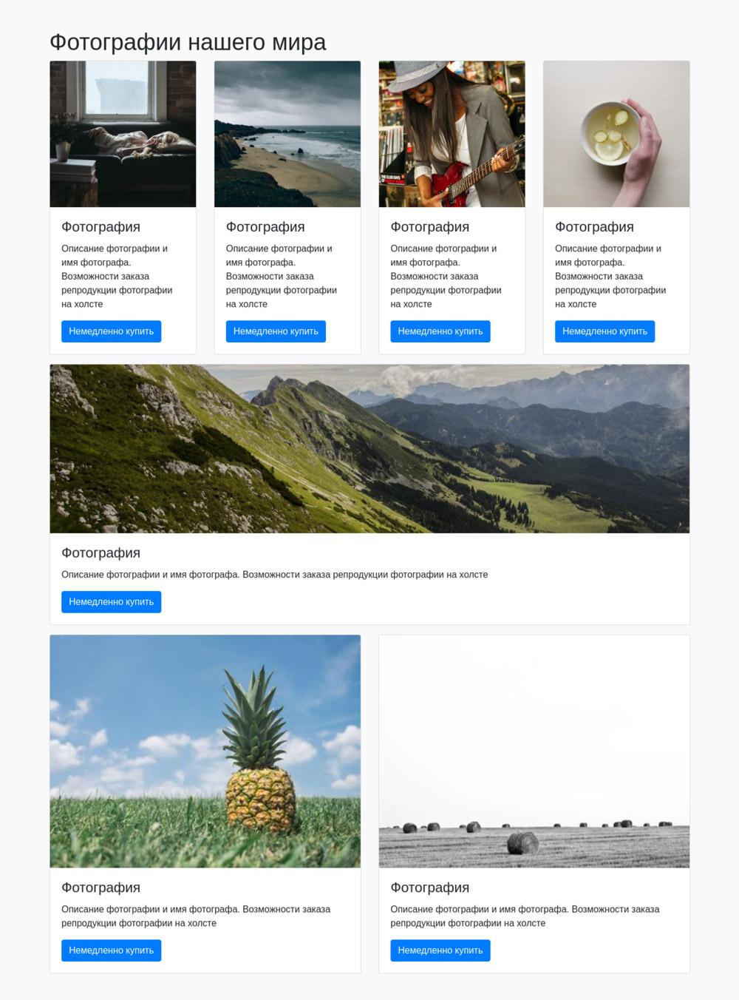

# Сетка

Создайте сетку для товаров интернет-магазина. Магазин занимается печатью репродукции фотографий на холсте. Ваша задача: сверстать три строки с карточками используя классы, которые были изучены в этом уроке. В качестве карточек товара используется следующая разметка:

```html
<article class="card">
  
  <div class="card-body">
    <h2 class="card-title h4">Фотография</h2>
    <p class="card-text">
      Описание фотографии и имя фотографа. Возможности заказа репродукции
      фотографии на холсте
    </p>
    <a href="#" class="btn btn-primary">Немедленно купить</a>
  </div>
</article>
```

Для каждой новой карточки используйте новую картинку. Они пронумерованы от 1 до 7 и находятся в директории `images/1`. Добавляйте изображения последовательно. Первая карточка имеет картинку с именем _1.jpg_. Последняя карточка содержит картинку с именем _7.jpg_.

## Задание

1. Создайте контейнер.
2. Добавьте заголовок `h1` с названием «Фотографии нашего мира».
3. Создайте три строки и распределите колонки. Bootstrap — 12 колоночная система. Исходя из этого, укажите правильные классы для колонок.
4. К каждой строке добавьте класс `mb-3`. Это создаст отступ снизу от строки.
5. Используя разметку карточек, добавьте их во все колонки. Не забудьте изменить изображение.

В результате разметки сетки получится следующая структура:


