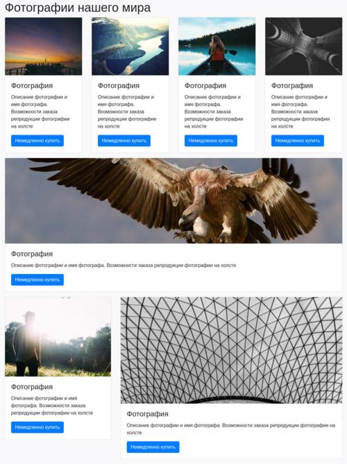
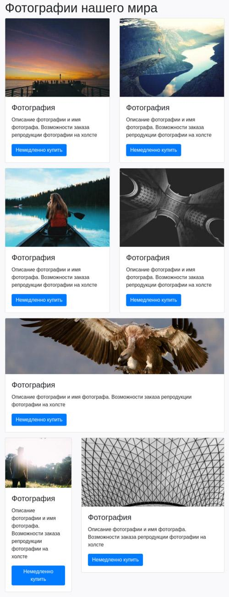
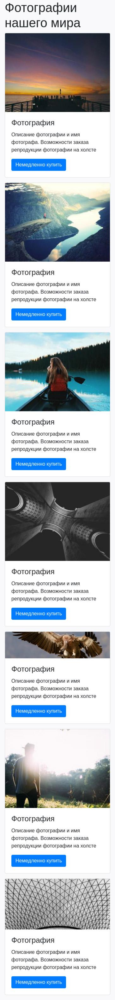

# Адаптивность

Адаптируйте новую сетку магазина по продаже репродукций фотографий на холсте. В отличие от прошлого шаблона в этом изменилась последняя строка. Обратите на это внимание. Используя необходимые классы, создайте сетку.

Карточка товара имеет следующую структуру:

```html
<article class="card">
  
  <div class="card-body">
    <h2 class="card-title h4">Фотография</h2>
    <p class="card-text">
      Описание фотографии и имя фотографа. Возможности заказа репродукции
      фотографии на холсте
    </p>
    <a href="#" class="btn btn-primary">Немедленно купить</a>
  </div>
</article>
```

Для каждой новой карточки используйте новое изображение. Они пронумерованы от 1 до 7 и находятся в директории `images/2`. Добавляйте изображения последовательно. Первая карточка содержит изображение с именем _1.jpg_. Последняя карточка содержит изображение с именем _7.jpg_.

## Задание

1. Создайте контейнер.
2. Добавьте заголовок `h1` с названием «Фотографии нашего мира».
3. Создайте три строки и распределите колонки. Bootstrap — 12 колоночная система. Исходя из этого, укажите правильные классы для колонок.
4. К каждой колонке добавьте класс `mb-3`. Это создаст отступ снизу при адаптивности.Используя разметку карточек, добавьте их во все колонки. Не забудьте изменить изображение.
5. Адаптивность:

- На разрешениях до 576px по ширине: каждая колонка занимает всё доступное пространство.
- На разрешениях от 576px до 992px по ширине: карточки первой строки располагаются в две строки.
- На разрешениях от 992px по ширине в первой строке четыре карточки в ряд.

В результате разметки сетки получится следующая структура:







## Подсказки

- Последняя строка разбивается на две колонки: первая занимает 4 ячейки, вторая 8 ячеек
