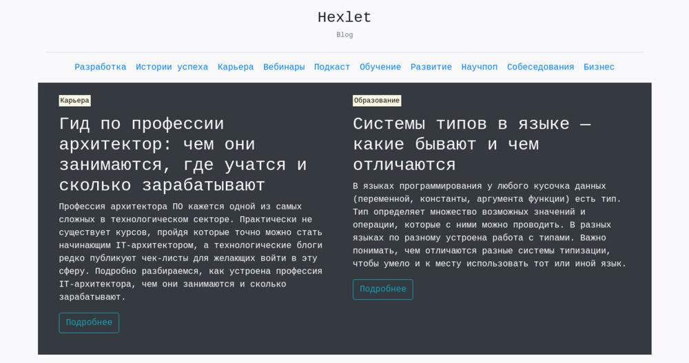

# Работа с текстом

Сверстайте шапку сайта и превью для блога. Этот блог использует моноширинный шрифт. Шапка сайта состоит из логотипа, горизонтальной черты и меню. Используя классы Bootstrap и HTML-теги, создайте вёрстку по представленному шаблону.

## Шапка

- Заголовок первого уровня: Hexlet. Внешне текст должен выглядеть как заголовок третьего уровня.
- Заголовок второго уровня: Блог. Заголовок имеет уменьшенный размер шрифта и текст `text-muted`. Вам понадобится класс `small`.
- Горизонтальная черта.
- Меню состоит из 10 категорий. Список выровнен по центру.
  - Разработка
  - Истории успеха
  - Карьера
  - Вебинары
  - Подкаст
  - Обучение
  - Развитие
  - Научпоп
  - Собеседования
  - Бизнес

## Превью статей

До ширины 768px каждое превью занимает 100% ширины контейнера. В остальных случаях по половине размера контейнера.

Каждое превью состоит из четырёх частей:

- Категория. Это параграф с текстом, представленным в виде выделенной области. Для выделения используйте тег `<mark>`. Размер шрифта — уменьшённый. Класс с размером шрифта устанавливается у параграфа.
- Заголовок второго уровня.
- Параграф с описанием статьи.
- Ссылка с классами `btn` и `btn-outline-info`.
- От каждого превью сделайте отступ снизу. Для этого используйте класс `mb-3`.

## Текст первой статьи

- **Категория**: Карьера
- **Заголовок**: Гид по профессии архитектор: чем они занимаются, где учатся и сколько зарабатывают
- **Текст**: Профессия архитектора ПО кажется одной из самых сложных в технологическом секторе. Практически не существует курсов, пройдя которые точно можно стать начинающим IT-архитектором, а технологические блоги редко публикуют чек-листы для желающих войти в эту сферу. Подробно разбираемся, как устроена профессия IT-архитектора, чем они занимаются и сколько зарабатывают.

## Текст второй статьи

- **Категория**: Образование
- **Заголовок**: Системы типов в языке — какие бывают и чем отличаются
- **Текст**: В языках программирования у любого кусочка данных (переменной, константы, аргумента функции) есть тип. Тип определяет множество возможных значений и операции, которые с ними можно проводить. В разных языках по разному устроена работа с типами. Важно понимать, чем отличаются разные системы типизации, чтобы умело и к месту использовать тот или иной язык.

Итогом проделанной работы станет следующий макет:



## Подсказки

- Используйте теги и классы для работы с текстом из [документации Bootstrap](https://getbootstrap.com/docs/5.1/content/typography/).
- Чтобы убрать подчёркивание у ссылок используется класс `text-decoration-none`.
- При создании секции `header` придерживайтесь структуры `row → col`. Общая схема будет такой:

```
row
  col
    Заголовки

hr

row
  col
    Меню
```

- Для создания меток категории используйте шаблон `<p class="small"><mark>Метка</mark></p>`.
