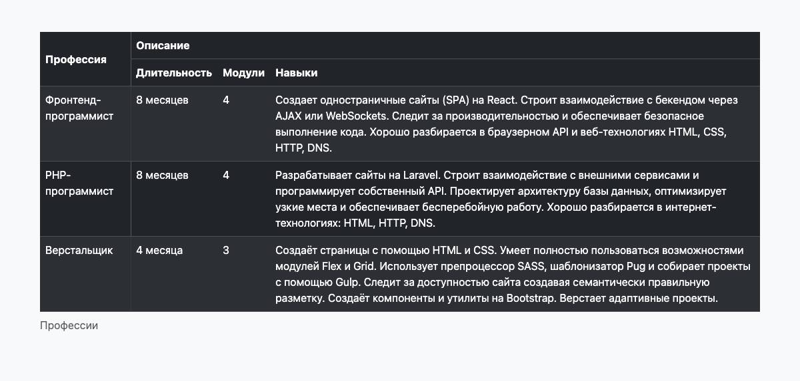

# Таблицы

Создайте часть таблицы профессий. Таблица описывает программу обучения на платформе и предлагает пользователю сравнить навыки, которые приобретаются в профессиях. Используя описания трёх профессий вы сверстаете таблицу и приведёте её к тёмной теме.

## Задачи

- Сверстайте таблицу по макету. Определите, какие строки и столбцы должны быть объединены.
- Заполните таблицу информацией.
- Используя доступные классы Bootstrap, стилизуйте таблицу:
  - Установите тёмную тему.
  - Строки таблицы имеют чередующийся фон (striped).
  - Добавьте описание таблицы используя специальный тег. Текст «Профессии Хекслета».

## Информация в таблице

### Фронтенд-программист

- Длительность: 8 месяцев
- Модули: 4
- Навыки: Создает одностраничные сайты (SPA) на React. Строит взаимодействие с бекендом через AJAX или WebSockets. Следит за производительностью и обеспечивает безопасное выполнение кода. Хорошо разбирается в браузерном API и веб-технологиях HTML, CSS, HTTP, DNS.

### PHP-программист

- Длительность: 8 месяцев
- Модули: 4
- Навыки: Разрабатывает сайты на Laravel. Строит взаимодействие с внешними сервисами и программирует собственный API. Проектирует архитектуру базы данных, оптимизирует узкие места и обеспечивает бесперебойную работу. Хорошо разбирается в интернет-технологиях: HTML, HTTP, DNS.

### Верстальщик

- Длительность: 4 месяца
- Модули: 3
- Навыки: Создаёт страницы с помощью HTML и CSS. Умеет полностью пользоваться возможностями модулей Flex и Grid. Использует препроцессор SASS, шаблонизатор Pug и собирает проекты с помощью Gulp. Следит за доступностью сайта создавая семантически правильную разметку. Создаёт компоненты и утилиты на Bootstrap. Верстает адаптивные проекты.

## Финальный вид таблицы

## Подсказки

- Используйте [документацию Bootstrap](https://getbootstrap.com/docs/5.1/content/tables/).
- Для выравнивания текста по вертикали внутри ячейки используйте класс `.align-middle`.
