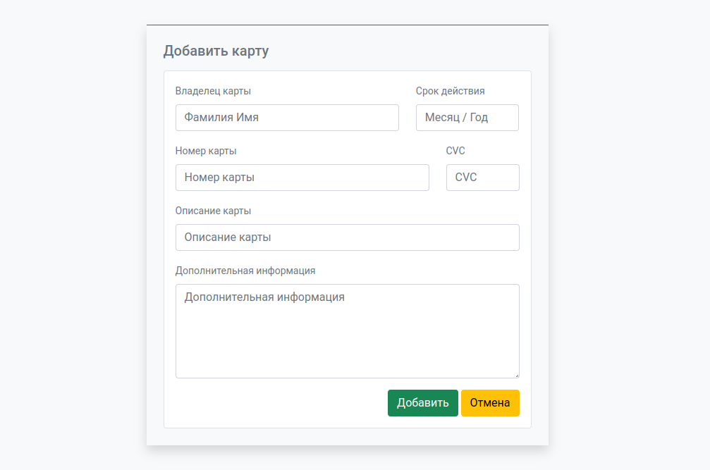

# Компоненты

Используя компонент форм, создайте форму добавления дебетовой/кредитной карты в личном кабинете пользователя. Используйте доступные средства Bootstrap для вёрстки макета.

Форма состоит из пяти строк:

- Поля «Владелец карты» и «Срок действия». Поля являются текстовыми. Поле «Владелец карты» занимает 8 столбцов в сетке.
- Поля «Номер карты» и «CVC» имеют тип `number`. Поле «Номер карты» занимает 9 столбцов в сетке.
- Поле «Описание карты» имеет текстовый тип и занимает всё доступное пространство в строке.
- Поле «Дополнительная информация» имеет тип `textarea` и занимает всё доступное пространство в строке. По умолчанию поле занимает 5 строк (атрибут `rows`).
- Кнопки «Добавить» и «Отмена». Они реализуются с помощью компонента `Buttons`.

Итогом выполнения задания станет следующий макет:

## Подсказки

- Для `label` используйте классы `text-muted`, `small` и `form-label`.
- Для выравнивания кнопок можно использовать класс `text-end`.
- От каждой строки, кроме последней, сделайте отступ с помощью `mb-3`.
- Для `input` и `textarea` используйте класс `form-control`.
- Обратите внимание, что `input` и `textarea` можно связать с `label` двумя способами, в данном случае удобнее связать их по идентификатору.
